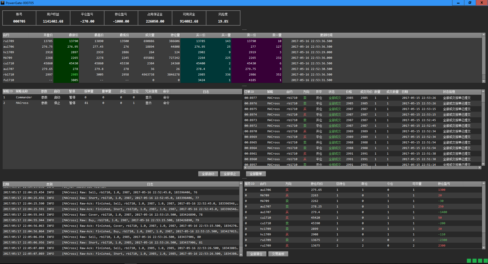

# PowerGate: AlgoSE算法策略引擎图形前端
PowerGate是AlgoSE引擎的图形前端，它基于Qt编写，方便用户以图形界面的方式管理交易策略。
## 功能
PowerGate的主要目的是帮助用户管理交易策略，它的功能包括：  
1. 配置交易账户。  
2. 加载和控制用户的交易策略。  
3. 查看账户、行情、报单、持仓、通道连接状态等信息。  
4. 手工交易。  
5. 每日定时重启，做到无人值守。  
6. 异常情况邮件报警。  
7. 可设置认证服务器，只有通过认证才能启动。  
8. ...
## 界面
PowerGate的主界面如下：  
